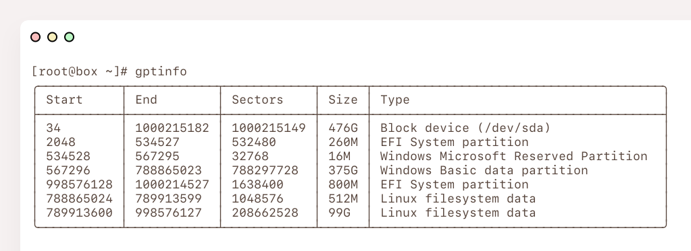

<h1 align="center">gptinfo</h1>

<p align="center">
    <i>A CLI tool to analyze partition tables</i>
    <hr />
</p>

## 🦀 Features

`gptinfo` is a command line tool to list partition tables on a block device for UEFI systems. It can:

- Display information in an `fdisk -l`-style table on a per-partition basis
  - Device type based on its GUID
  - Start/End LBAs and total sector count
  - Partition size

## ✨ In Action



## 📥 Installation

```sh
# install cargo through rustup
curl --proto '=https' --tlsv1.2 -sSf https://sh.rustup.rs | sh

# install crate
cargo install gptinfo
```

## 🛠️ Usage

```
$ gptinfo --help
gptinfo v2.0.0

USAGE:
	gptinfo [-h/-v] <device>

FLAGS:
	-h, --help    - display this help message
	-v, --version - print the current version of `gptinfo`

ARGUMENTS:
	device        - block device to read GPT from (default: /dev/sda)
```

## 🔮 Contributing

If you feel like you can make a meaningful contribution to `gptinfo`, feel free to fork this repository and create a [pull request](https://github.com/safinsingh/gptinfo/pulls)! Feature requests and bugs can be filed on the [issues](https://github.com/safinsingh/gptinfo/issues) tab.

## 👨‍💻 Authors

- [Safin Singh](https://safin.dev)
